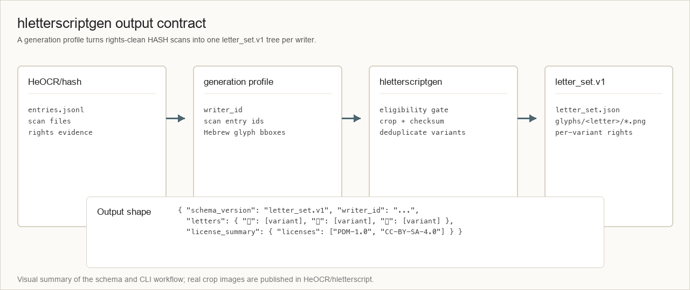
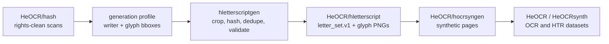

# hletterscriptgen

[](https://github.com/HeOCR/hletterscriptgen/actions/workflows/ci.yml)


Created by [Shay Palachy Affek](http://www.shaypalachy.com/).

Generator framework for per-writer Hebrew handwritten letter-glyph image
sets. It turns rights-clean HASH scan records plus human-reviewed glyph
annotations into deterministic `letter_set.v1` outputs for
[`HeOCR/hletterscript`](https://github.com/HeOCR/hletterscript).



## At a Glance

| Field | Value |
| --- | --- |
| Role | Generate and validate per-writer Hebrew letter-set outputs |
| Input | HASH scan metadata, scan image files, and generation profiles |
| Output | `letter_set.v1` JSON plus cropped glyph PNG assets |
| Public contract | [`docs/letter_set_v1.md`](docs/letter_set_v1.md) |
| Example fixture | [`examples/letter_set/writer_example.json`](examples/letter_set/writer_example.json) |
| Main CLI | `hletterscriptgen` |
| Code license | MIT |
| Generated glyph rights | Per-variant rights inherited from upstream scans |

## What This Repository Owns

This repository contains the Python package, CLI, schema, and validation
contracts for creating writer-level Hebrew letter sets. It does not host
the published glyph dataset itself; generated and curated data belongs in
[`HeOCR/hletterscript`](https://github.com/HeOCR/hletterscript).

What lives here:

- `hletterscriptgen`, the Python package and command-line interface.
- The `letter_set.v1` JSON Schema and fixture example.
- Generation-profile parsing, upstream eligibility checks, glyph
  extraction helpers, checksum calculation, and output validation.
- CI, release workflow, and rights-carryover policy.

What lives elsewhere:

- Page-scan ingestion and rights curation:
  [`HeOCR/hash`](https://github.com/HeOCR/hash).
- Published letter-glyph image sets:
  [`HeOCR/hletterscript`](https://github.com/HeOCR/hletterscript).
- Synthetic document composition:
  [`HeOCR/hocrsyngen`](https://github.com/HeOCR/hocrsyngen).
- Dataset orchestration and release assembly:
  [`HeOCR/hocrgen`](https://github.com/HeOCR/hocrgen),
  [`HeOCR/HeOCR`](https://github.com/HeOCR/HeOCR), and
  [`HeOCR/HeOCRsynth`](https://github.com/HeOCR/HeOCRsynth).

## Pipeline Position



See [`docs/repository_scope.md`](docs/repository_scope.md) for the full
ecosystem boundary map and per-repository responsibilities.

## Install

```bash
python -m pip install -e ".[test]"
```

For development:

```bash
python -m pip install -e ".[dev]"
```

Requires Python 3.11 or newer.

## CLI

```bash
hletterscriptgen version
hletterscriptgen schema --format json
hletterscriptgen validate examples/letter_set/writer_example.json
hletterscriptgen check-eligible path/to/hash/data/index/entries.jsonl
hletterscriptgen scan-blobs path/to/scan.png --format json
hletterscriptgen generate --profile generate_profile.json --output ./out
```

The `generate` command expects a human-curated generation profile that
names writer IDs, upstream scan entries, and glyph bounding boxes. The
output is one directory per writer, each containing `letter_set.json` and
the surviving cropped glyph assets.

## The `letter_set.v1` Contract

The bundled schema describes one writer's letter-glyph collection:

- `writer_id` identifies the writer set.
- `writer_provenance` records how the writer attribution was established.
- `upstream` pins the exact HASH revision used by the generation run.
- `letters` maps Hebrew letters and final forms to one or more glyph
  variants.
- Each variant carries an asset path, checksum, image metadata, source
  scan ID, bounding box, license, and rights evidence.
- `license_summary` summarizes the distinct variant-level licenses but
  does not replace per-variant rights metadata.

Read the full contract in [`docs/letter_set_v1.md`](docs/letter_set_v1.md).

## Validate Locally

```bash
python -m ruff check .
python -m mypy
python -m pytest
hletterscriptgen validate examples/letter_set/writer_example.json
```

## Licensing

- Code in this repository is MIT licensed. See [`LICENSE`](LICENSE).
- Generated letter sets carry per-variant upstream rights. See
  [`LICENSE-POLICY.md`](LICENSE-POLICY.md); the generator records rights
  evidence but does not relicense glyphs.

## Contributing

See [`CONTRIBUTING.md`](CONTRIBUTING.md). Agent collaborators should also
read [`AGENTS.md`](AGENTS.md).

## Credits

Created by [Shay Palachy Affek ](http://www.shaypalachy.com/) [[GitHub](https://github.com/shaypal5)]
